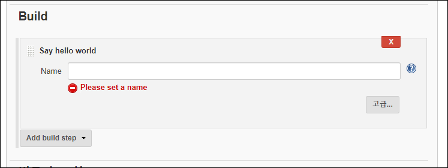

# 플러그인 빌드 및 실행하기

> 원문: https://www.jenkins.io/doc/developer/tutorial/run/

* 스텝 1:  [플러그인 개발 준비하기](Preparing-for-Plugin-Development.md)

* 스텝 2: [플러그인 만들기](Create-a-Plugin.md)

* **스텝 3: 플러그인 빌드 및 실행하기**

* 스텝 4: [플러그인 확장하기](Extend-the-Plugin.md)

Maven HPI 플러그인은 Jenkins 플러그인을 빌드하고 패키징하는 데 사용됩니다. 또한 플러그인으로 Jenkins 인스턴스를 실행하는 편리한 방법을 제공합니다.

```bash
mvn hpi:run
```

> Maven HPI 플러그인 및 제공하는 골(Goal)에 대해 자세히 알아보려면 [해당 문서](https://jenkinsci.github.io/maven-hpi-plugin/)를 참조해보세요.

이렇게 하면 `http://localhost:8080/jenkins/`에 Jenkins 인스턴스가 설정됩니다. 다음 콘솔 출력을 기다린 다음 웹 브라우저를 열고 플러그인이 무엇을 하는지 살펴보십시오.

```
정보: Jenkins is fully up and running
```

>Jenkins 홈 디렉토리로 플러그인 디렉토리의 `work/` 디렉토리가 사용됩니다. 이는 다음에 실행하더라도 데이터가 유지되는 것을 의미합니다.

Jenkins에서 새로 FreeStyle 프로젝트를 만들고 이름을 지정합니다.

그런 다음 "Say hello world" 빌드 스텝를 추가합니다. 다음과 같이 표시됩니다.



이름을 입력하고 프로젝트를 저장하고 새 빌드를 시작합니다. UI에서 빌드로 이동하고 *Console Output*을 클릭하여 빌드 로그를 봅니다. 여기에는 방금 설정한 빌드 스텝에서 작성한 메시지가 포함됩니다.

```bash
Started by user unknown or anonymous
Building in workspace C:\git\jenkins-study\jenkins-plugin\plugin-tutorial\sample-plugins\demo-plugin\work\workspace\job-demo-plugin-test
Hello, 젠킨스-초보자! # (1)
Finished: SUCCESS
```

1. 빌드 단계에서 추가된 인사말

터미널에서 `Ctrl-C`(또는 여러분의 시스템의 동등한 키입력)를 눌러 Jenkins를 중지합시다.

다음 스텝:  [플러그인 확장하기](Extend-the-Plugin.md)


## 문제 해결

작동하지 않는 것이 있습니까? 채팅이나 [jenkinsci-dev 메일링 리스트](https://www.jenkins.io/mailing-lists)에서 도움을 요청해보세요.