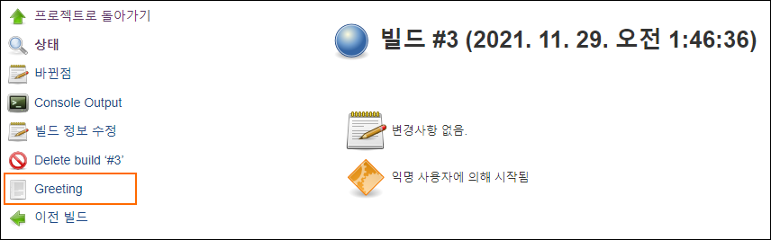
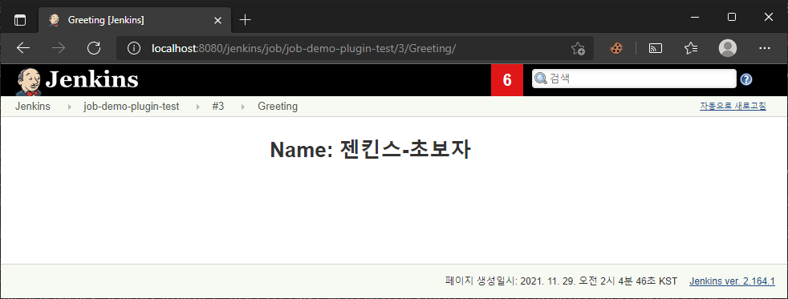
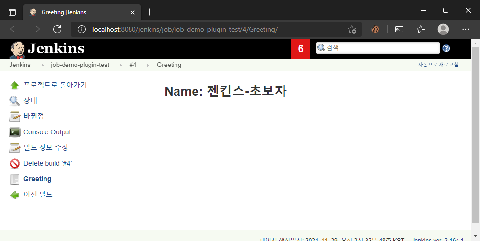

# 플러그인 확장하기

> 원문: https://www.jenkins.io/doc/developer/tutorial/extend/

* 스텝 1:  [플러그인 개발 준비하기](Preparing-for-Plugin-Development.md)

* 스텝 2: [플러그인 만들기](Create-a-Plugin.md)

* 스텝 3: [플러그인 빌드 및 실행하기](Build-and-Run-the-Plugin.md)

* **스텝 4: 플러그인 확장하기**

> 일반 텍스트 편집기로 따라할 수 있지만 이 섹션은 Maven을 지원하는 Java IDE를 사용하면 훨씬 쉽게 따라할 수 있습니다.

새로운 기능으로 샘플 플러그인을 확장할 때입니다.

* 빌드 로그뿐만 아니라 적절한 데이터 구조에 인사말에 사용된 이름을 기록합니다.
* 인사말에 사용된 이름을 표시하는 새 페이지를 빌드에 추가합니다.

구성이 변경될 수 있으므로 구성에 있는 이름을 사용하는 것보다 빌드가 실행될 때 사용된 이름을 저장하는 것이 중요합니다.


## 이름 기록

먼저 `HelloWorldBuilder`와 동일한 패키지에 `HelloWorldAction`이라는 클래스를 만듭니다. 해당 클래스는 [액션(Action)](https://javadoc.jenkins.io/byShortName/Action)을 구현해야 합니다. Action은 Jenkins의 확장성을 위한 기본 빌딩 블록입니다: 액션은 많은 모델 객체에 첨부될 수 있고, 함께 저장되며, 선택적으로 모델 객체의 UI에 추가될 수 있습니다.

```java
package io.jenkins.plugins.sample;

import hudson.model.Action;

public class HelloWorldAction implements Action {
  @Override
  public String getIconFileName() {
    return null;
  }

  @Override
  public String getDisplayName() {
    return null;
  }

  @Override
  public String getUrlName() {
    return null;
  }
}
```

인사말에 사용된 이름을 저장하고 싶기 때문에 이 클래스에 getter가 있는 필드를 추가해야 합니다. 또한 name을 파라미터로 사용하는 생성자를 추가합니다.

```java
(...)
public class HelloWorldAction implements Action {
  private String name;

  public HelloWorldAction(String name) {
    this.name = name;
  }

  public String getName() {
    return name;
  }  
  (...)
```

이제 빌드 스텝이 실행될 때 실제로 이 클래스의 인스턴스를 생성해야 합니다. 실행 중인 빌드에 생성한 액션의 인스턴스를 추가하려면 `HelloWorldBuilder` 클래스의 `perform` 메서드를 확장해야 합니다:

```java
(...)
  @Override
  public void perform(Run<?, ?> run, FilePath workspace, Launcher launcher, TaskListener listener)
      throws InterruptedException, IOException {
    run.addAction(new HelloWorldAction(name));  // <== (1)
    if (useFrench) {
      listener.getLogger().println("Bonjour, " + name + "!");
    } else {
      listener.getLogger().println("Hello, " + name + "!");
    }
  }
  (...)
```

**(1) 은 추가된 라인이고, 나머지는 그대로 유지합니다.**

이러한 변경 내용을 저장하고 `mvn hpi:run`을 사용하여 플러그인을 다시 실행합니다.

> Java 소스 코드를 변경하거나 리소스 파일을 추가 또는 제거할 때마다 변경 사항을 적용하려면 Jenkins 인스턴스를 다시 시작해야 합니다. Jenkins가 `hpi:run`을 통해 실행되는 동안에는 일부 리소스 파일만 편집할 수 있습니다.

이제 이 빌드 스텝으로 빌드가 실행될 때 액션이 빌드 데이터에 추가됩니다. `work/jobs/JOBNAME/builds/BUILDNUMBER/` 디렉토리의 빌드에 해당하는 `build.xml` 파일을 보면 이를 확인할 수 있습니다.


보다시피 이 빌드에는 두 가지 작업이 있습니다.

```xml
(...)
<build>
  <actions>
    <hudson.model.CauseAction>  <!-- (1) -->
      <causeBag class="linked-hash-map">
        <entry>
          <hudson.model.Cause_-UserIdCause/>
          <int>1</int>
        </entry>
      </causeBag>
    </hudson.model.CauseAction>
    <io.jenkins.plugins.sample.HelloWorldAction plugin="demo@1.0-SNAPSHOT"> <!-- (2) -->
      <name>젠킨스-초보자</name> <!-- (3) -->
    </io.jenkins.plugins.sample.HelloWorldAction>
  </actions>
  (...)
</build>
```

1. 빌드 원인(빌드가 트리거된 방법)도 액션으로 저장됩니다. 이 경우 익명 사용자가 빌드를 시작했습니다.
2. 이것은 우리가 만든 액션입니다.
3. 그리고 이것은 빌드가 생성될 때 사용된 이름입니다.


## 이름을 보여주는 뷰를 추가하기

다음으로 빌드와 함께 저장하고 있는 액션을 보여줘야 합니다.

먼저 `HelloWorldAction`으로 돌아가 아이콘, 제목 및 URL 이름을 정의해야 합니다:

```java
  @Override
  public String getIconFileName() {
    return "document.png"; // <== (1)
  }

  @Override
  public String getDisplayName() {
    return "Greeting"; // <== (2)
  }

  @Override
  public String getUrlName() {
    return "Greeting"; // <== (3)
  }
```

1. 사이드 패널 항목에 사용되는 아이콘입니다. `document.png`는 Jenkins에 번들로 제공되는 미리 정의된 아이콘 중 하나입니다.
2. 측면 패널 항목에 사용되는 레이블입니다.
3. 이 액션에 사용되는 URL 조각입니다.

이러한 변경으로 액션이 빌드의 측면 패널에 표시되고 URL에 대한 링크가 표시됩니다.

`\http://JENKINS/job/JOBNAME/BUILDNUMBER/greeting/`.



다음으로 해당 URL에 표시되는 페이지를 정의해야 합니다. Jenkins에서 이러한 뷰를 생성하기 위해 일반적으로 [Apache Commons Jelly](https://commons.apache.org/proper/commons-jelly/)가 사용됩니다. Jelly를 사용하면 XML 및 XHTML 출력을 XML로 정의할 수 있습니다. 이 목적에 유용한 많은 기능이 있습니다:

* 조건 및 루프 지원
* 다른 곳에서 정의된 뷰 조각을 포함할 수 있음
* 재사용 가능한 UI 구성 요소를 정의하는 데 사용할 수 있음

`src/main/resources/io/jenkins/plugins/sample/` 디렉토리에 `HelloWorldAction/`이라는 새 디렉토리를 만들어야 합니다. 이 디렉토리는 `HelloWorldAction` 클래스에 대응하는 관련 리소스를 포함합니다.

> 이것은 `src/main/java`가 아닌 `src/main/resources`에 있는 디렉토리입니다.

>`HelloWorldBuilder` 빌드 스텝과 관련된 리소스가 `src/main/resources/io/jenkins/plugins/sample/HelloWorldBuilder/` 디렉토리에 저장되어 있는 것을 볼 수 있습니다: `config.jelly`는 빌드 스텝 구성 폼이고 다양한 `config*.properties` 파일에는 빌드 스텝 구성에 대한 현지화가 포함되어 있으며 `help*.html` 파일은 구성에 대해 현지화된 인라인 도움말을 제공합니다.

`src/main/resources/io/jenkins/plugins/sample/HelloWorldAction/`에 `index.jelly`라는 파일을 만듭니다. 이것은 `\http://JENKINS/job/JOBNAME/BUILDNUMBER/greeting/` URL에 표시됩니다. 다음 내용를 추가합니다.

```jsp
<?jelly escape-by-default='true'?>
<j:jelly xmlns:j="jelly:core" xmlns:l="/lib/layout" xmlns:st="jelly:stapler">
  <l:layout title="Greeting"> <!-- (1) -->
    <l:main-panel> <!-- (2) -->
      <h1> <!-- (3) -->
        Name: ${it.name} <!-- (4) -->
      </h1>
    </l:main-panel>
  </l:layout>
</j:jelly>
```

1. `layout`은 헤더, 측면 패널, 기본 컨텐츠 영역 및 바닥글이 있는 기본 페이지 레이아웃을 제공하는 Jenkins 코어에 정의된 재사용 가능한 태그입니다.
2. 메인 컨텐츠 영역(예: 측면 패널이 아닌)에 이름을 표시하려면 출력을 `main-panel` 태그로 래핑해야 합니다.
3. 모든 HTML 태그를 사용할 수 있으며 출력에 사용됩니다.
4. 이것은 [JEXL](https://commons.apache.org/proper/commons-jexl/) 표현식입니다. `it`은 뷰가 속한 Java 객체를 참조합니다(Java의 `this`와 유사). 이 경우 `HelloWorldAction` 인스턴스입니다. `it.name`은 getter 호출(`getName()`)과 동일합니다.

결과 페이지는 다음과 유사합니다.




## 뷰에 빌드용 측면 패널 추가

위의 출력에는 측면 패널이 없습니다. 이 보기는 특정 빌드와 관련이 있으므로 해당 빌드의 측면 패널도 표시되어야 합니다. 그렇게 하려면 먼저 액션에서 해당 빌드에 대한 참조를 얻은 다음 액션 뷰에 빌드의 측면 패널 뷰 *조각*을 포함해야 합니다.

`HelloWorldAction`이 속한 빌드(또는 더 일반적으로 Run)에 대한 참조를 얻으려면 기존 클래스를 변경하여 [RunAction2](https://javadoc.jenkins.io/byShortName/RunAction2)를 구현하도록 해야 합니다.

이 인터페이스는 run이 처음 빌드에 연결될 때(`onAttached(Run)`), 액션과 run이 디스크에서 로드될 때(`onLoad(Run)`) 각각 호출되는 두 가지 메서드를 추가합니다.

```java
(...)
import hudson.model.Run;
import jenkins.model.RunAction2;

public class HelloWorldAction implements RunAction2 { // <== (1)
  private transient Run run; // <== (2)

  @Override
  public void onAttached(Run<?, ?> run) {
    this.run = run; // <== (3)
  }

  @Override
  public void onLoad(Run<?, ?> run) {
    this.run = run; // <== (4)
  }

  public Run getRun() { // <== (5)
    return run;
  }
  (...)
```

1. `RunAction2`는 Run에 추가된 액션이 Run에 대한 참조를 올바르게 가져오도록 구현할 인터페이스입니다.
2. `Run`은 일시적인 액션에 저장되므로 이 필드는 액션과 함께 디스크에 직렬화되지 않습니다.
3. 이 액션을 `Run`에 처음 연결할 때 필드를 설정합니다.
4. 디스크에서 이 액션을 로드할 때 필드를 설정합니다.
5. 이렇게 하면 Jelly 뷰에서 `Run`을 사용할 수 있습니다. -- private 필드에는 액세스할 수 없습니다.

이 작업 완료되면 `Run`의 측면 패널 보기 조각을 포함하도록 보기를 확장해야 합니다.

```jsp
  <l:layout title="Greeting">
    <l:side-panel> <!-- (1) -->
      <st:include page="sidepanel.jelly" it="${it.run}" optional="true" /> <!-- (2) -->
    </l:side-panel>
    <l:main-panel>
      (...)
    </l:main-panel>
  </l:layout>
(...)
```

1. 메인 패널과 마찬가지로 컨텐츠가 측면 패널에만 표시되기를 원하기 때문에 이 요소로 감싸야 합니다.
2. 여기에는 이 위치에 있는 다른 객체(Run)의 뷰 조각(`sidepanel.jelly`)이 포함됩니다. 추상 클래스 `Run`은 이러한 뷰를 정의하지 않고 하위 클래스인 [AbstractBuild](https://javadoc.jenkins.io/byShortName/AbstractBuild)만 정의하므로 이 뷰 조각이 존재하지 않는 경우 오류가 표시되지 않도록 이를 선택 사항(`optional="true"`)으로 표시합니다.

이러한 변경으로 우리가 만든 뷰는 Jenkins UI와 제대로 통합되어 빌드와 관련된 기본 제공 페이지와 다르지 않게 나타납니다:



축하합니다. Jenkins 플러그인을 성공적으로 만들고 확장했습니다!


## 문제 해결

> 작동하지 않는 것이 있습니까? IRC나 [jenkinsci-dev 메일링 리스트](https://www.jenkins.io/mailing-lists)에서 도움을 요청해보세요.


## 의견

* 전에 모델클래스를 쓰긴 했는데... Action 클래스를 상속해서 쓰지 않고, 스테이플러 어노테이션 붙여서 썼던 것 같은데, 오래되서인지 생각이 안난다. ㅎㅎ

* 역시 문제는 파이프라인을 사용해서 Job을 설정한 경험이 없다는게 문제이긴하다. 틈틈히 해봐야겠다.

  

