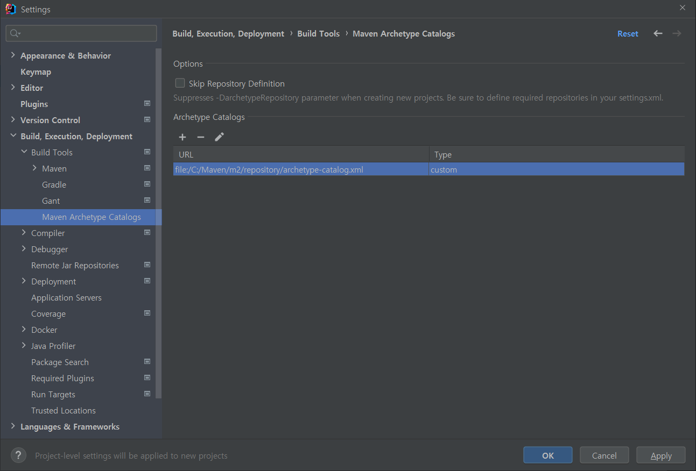

# 플러그인 개발 준비하기

> 원문: https://www.jenkins.io/doc/developer/tutorial/prepare/

* **스텝 1:  플러그인 개발 준비하기**
* 스탭 2: [플러그인 만들기](Create-a-Plugin.md)
* 스탭 3: [플러그인 빌드 및 실행하기](Build-and-Run-the-Plugin.md)
* 스탭 4: [플러그인 확장](Extend-the-Plugin.md)

## JDK 다운로드 및 설치

Jenkins는 Java 기반이므로 Jenkins 플러그인을 빌드하려면 JDK(Java Development Kit)를 설치해야 합니다. Java 11은 사용자에게 권장하는 버전이므로 이 튜토리얼에서 사용하고 있습니다.

[Eclipse Temurin 웹 사이트](https://adoptium.net/?variant=openjdk11&jvmVariant=hotspot)에서 Java 11을 다운로드하여 설치할 수 있습니다.

>많은 Linux 배포판들이 더 쉬운 설치 및 업그레이드 경험을 위해 Java용 패키지를 제공합니다. 자세한 내용은 배포판 설명서를 참조하세요. Java가 이미 설치되어 있는지 확인하려면 명령 프롬프트에서 `java -version`을 실행합니다. 이 경로로 사용하기로 결정했다면 Maven 3의 최신 버전(이상적으로는 3.8.3 이상)이 제공되었는지 확인해보세요.


## Maven 다운로드 및 설치

Jenkins 플러그인은 대부분 Maven을 사용하여 빌드하므로 이 튜토리얼에서 사용할 것입니다.

[Apache Maven 웹 사이트](https://maven.apache.org/)에서 Maven을 다운로드합니다. 바이너리 아카이브(이름에 `bin` 포함) 중 하나를 다운로드해야 합니다.

>많은 Linux 배포판들이 더 쉬운 설치 및 업그레이드 경험을 위해 Maven용 패키지를 제공합니다. 자세한 내용은 배포판 설명서를 참조하세요. macOS에서 Homebrew 패키지 메니저는 Maven 패키지를 제공합니다.

Maven의 압축을 풀고 위치를 기록해 둡니다. 그런 다음 압축 풀린 위치의 `bin/` 하위 디렉토리의 전체 경로(예: `~/Applications/apache-maven/bin/mvn` 또는 `C:\Program files\Maven\bin\mvn`)를 OS의 `PATH` 변수에 추가합니다. (이렇게 하면` mvn`을 사용하여 Maven을 실행할 수 있습니다). 

튜토리얼의 나머지 부분에서는 Maven이 `PATH`에 있다고 가정하지만 전체 경로를 입력할 수도 있습니다.

Maven이 설치되었는지 확인하려면 다음 명령을 실행합니다.

```bash
mvn -version
```

이 명령은 Java 및 Maven 버전 및 Maven에서 찾은 Java 설치를 포함하여 일부 진단 출력을 화면에 표시합니다. *11* 버전의 Java를 표시하고 Java가 있는 경로를 나열해야 합니다. 이 정보가 표시되지 않으면 맨 아래의 문제 해결 항목을 참조하세요.


## IDE로 개발 환경 설정하기

### NetBeans

NetBeans 사용자는 IDE의 Maven 지원을 사용하여 프로젝트를 직접 열 수 있습니다. 

코드를 탐색할 때 기본 콘텐츠 창 상단에 나타나는 "Attach" 버튼을 클릭하여 소스 코드 JAR 파일을 첨부하도록 NetBeans에 지시할 수 있습니다. 이를 통해 플러그인을 개발할 때 Jenkins 핵심 소스 코드를 읽을 수 있습니다. (또는 의존성 노드에서 소스 다운로드를 선택하기만 하면 됩니다.)

[Jenkins/Stapler 개발을 위한 NetBeans 플러그인](https://github.com/stapler/netbeans-stapler-plugin)을 사용하는 것이 좋습니다. 이것은 많은 Jenkins 관련 기능을 제공합니다. 가장 눈에 띄는 부분은 New Project » Maven » Jenkins Plugin을 사용하여 새 플러그인을 만들고 Run project로 테스트하는 것입니다. 


### IntelliJ IDEA

IntelliJ 사용자는 프로젝트를 열기만 하면 모든 것을 바로 사용할 수 있습니다.

[Stapler용 IntelliJ IDEA 플러그인](https://plugins.jetbrains.com/plugin/1885-stapler-framework-support)을 사용하는 것이 좋습니다. 이 플러그인이 제공하는 기능은 [문서](https://github.com/jenkinsci/idea-stapler-plugin#stapler)에서 찾을 수 있습니다.

* Plugins » Marketplace » Stapler Framework Support

  

Jenkins 플러그인 [archetype](https://github.com/jenkinsci/archetypes/)들 중 하나를 사용하여 새 플러그인을 만들 수 있습니다. 


#### Jenkins 플러그인 아키타입 설치

예전 튜토리얼에서는 jenkins의 레파지토리 주소들을 settings.xml에 따로 등록한 다음 mvn 으로 아키타입 불러와서 진행했던 것 같은데, 이번에는 그냥 아키타입 프로젝트를 clone해서 로컬 레파지토리에 설치해서 그것을 인식해서 사용하도록 해보겠습니다.

```bash
# 아키타입 클론
$ git clone https://github.com/jenkinsci/archetypes

# 가장 최신 테그 확인 (2021/11/28)
$ git describe --abbrev=0
archetypes-1.11

# 가장 최신 태그로 브랜치 만들어 체크아웃
$ git checkout tags/archetypes-1.11 -b archetypes-1.11
Switched to a new branch 'archetypes-1.11'

# 로컬에 설치해보자! (테스트 시간이 꽤 걸린다.)
$ mvn clean install

```


### 로컬 아키타입 경로 설정

* IntelliJ에서는 외부 ArcheType을 설정할 수 없기 때문에, 플러그인 설치가 필요합니다, 아래 플러그인을 우선 설치합니다.

  * [Maven Archetype Catalogs](https://plugins.jetbrains.com/plugin/7965-maven-archetype-catalogs)

* 설치 후, Settings  » Build, Execution, Deployment » Build Tools » `Maven Archetype Catalogs` 메뉴에서 `~/.m2/repository/archetype-catalog.xml` 을 추가해줍니다.

  

* 이후 부터 io.jenkins.archetypes에 대한 목록이 정상적으로 나타납니다.
  
  

 

**Create from archetype** 및 **Add an Archetype**을 사용하여 새 Maven 프로젝트를 만듭니다. 

위와 같이 GroupId 및 ArtifactId를 선택하고 버전으로 RELEASE를 선택합니다.

다음 화면에서 groupID로 io.jenkins.plugins를 선택하고 원하는 대로 artifactId(Project 이름)와 버전을 선택합니다. (연습용이라서 GroupId를 임의로 적었는데, 플러그인 반영을 해야한다면 반드시 `io.jenkins.plugins` 로 적도록 합니다.)


그러면 지정된 아티팩트(예: `empty-plugin`)를 기반으로 maven 프로젝트가 자동으로 생성됩니다.

##### empty-plugin 기반으로 생성된 플러그인 동작확인

플러그인의 사용자 정의 동작 코드는 없는 상태이지만, Maven의 `hpi:rum` 테스크를 실행하면 Jetty로 Jenkins를 실행시키고 개발 중인 플러그인을 Jenkins에 설치된 상태로 만들어주므로, 플러그인의 동작을 시험해 볼 수 있습니다.


### Eclipse

프로젝트를 기존 Maven 프로젝트로 엽니다.

* File » Import » Maven » `Existing Maven Projects`


## 다음 스텝

*  [플러그인 만들기](Create-a-Plugin.md)


## 문제 해결

>동작하지 않는 것이 있습니까? 커뮤니티 포럼 [community.jenkins.io](https://community.jenkins.io/) 또는 [jenkinsci-dev 메일링 리스트](https://www.jenkins.io/mailing-lists)에서 도움을 요청해보세요


## 참조

* [Eclipse Temurin Java](https://adoptium.net/)
* [Apache Maven 웹사이트](https://maven.apache.org/)


## 의견 / 진행

- [x] IntelliJ 관련 설명에 그림이 있는 것 처럼 설명을 하는데 사진이 빠져있어 직접해보고 화면 캡처를 추가했다.
  * 예전 튜토리얼에는 settings.xml에 레파지토리 / 플러그인 레파지토리 / 미러 사이트 등을 추가해줬던 것 같은데... 현재 문서에는 그런 내용이 없다.
  * Archetype Type을 별도로 로컬 레파지토리에 install 해서 사용하는 내용이 없다면 settings.xml을 설정해주는 내용이 들어가야할 것 같은데, 아래 가이드의 경우는 settings.xml을 설정해주는 가이드가 있다.
    * https://www.velotio.com/engineering-blog/jenkins-plugin-development